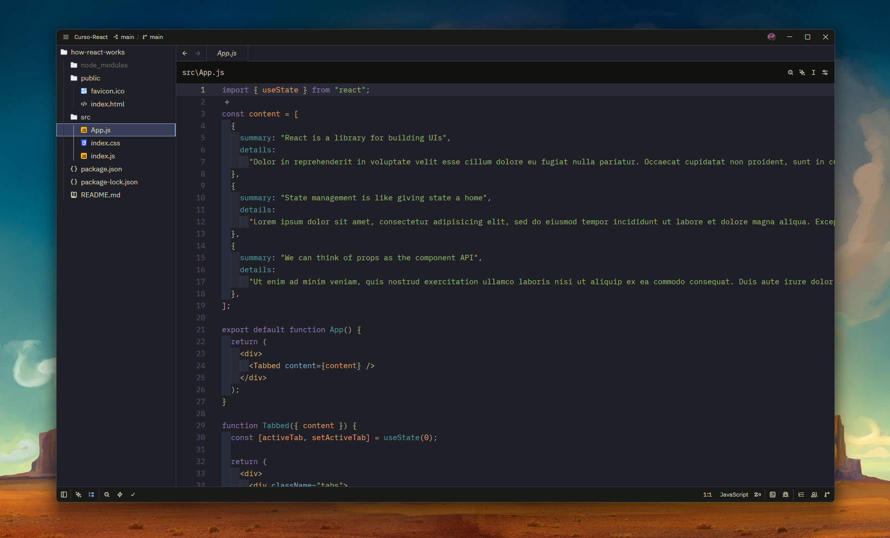
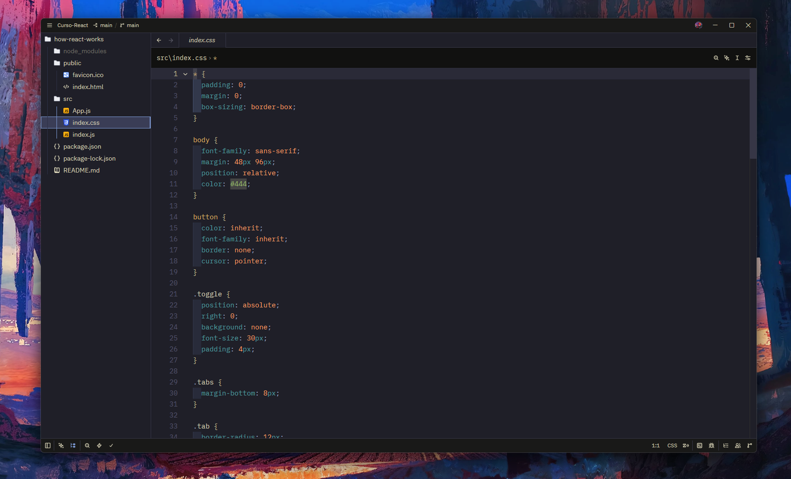
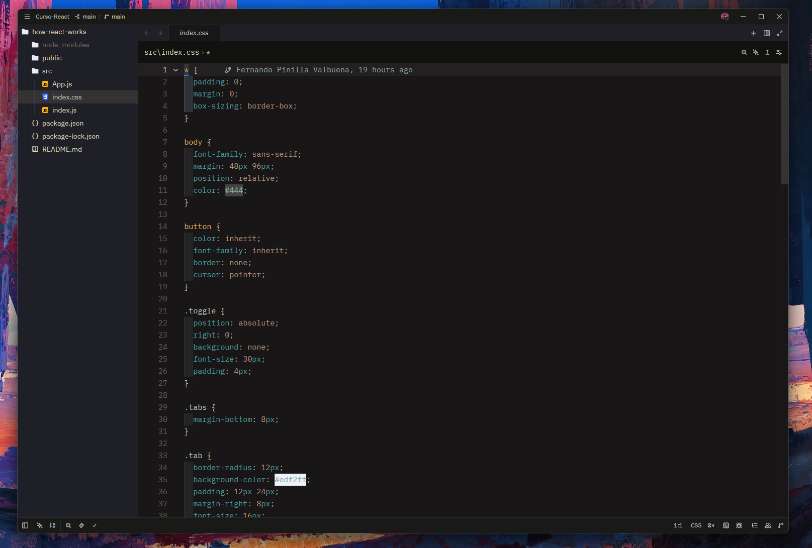
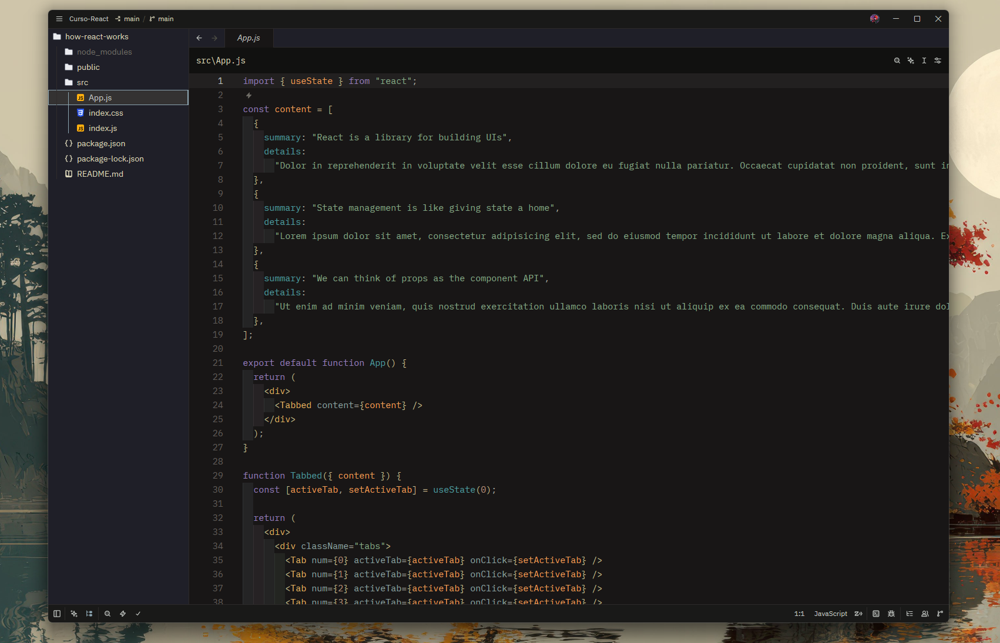

# Kanagawa Like for Zed

[](https://github.com/Dunlag/kanagawa-like-zed-theme/releases)
[](LICENSE)
[](https://zed.dev/extensions?query=kanagawa-like)

A Kanagawa-inspired dark theme for Zed, tuned to match the feel of popular VS Code and Neovim Kanagawa setups rather than being a strict port.

---

## Variants

| Variant | Background | Foreground | Character |
|---------|-----------|------------|-----------|
| **Wave** | `#1f1f28` (deep ocean blue-black) | `#dcd7ba` (warm cream) | Warmer, more purple-tinted accents |
| **Dragon** | `#181616` (darker, cooler black) | `#c5c9c5` (cool grey-white) | Muted, earthier tones |

---

## Preview

### Kanagawa Like Wave





### Kanagawa Like Dragon





---

## Color Palette

### Wave

| Role | Hex | Usage |
|------|-----|-------|
| Background | `#1f1f28` | Editor, panel, terminal |
| Foreground | `#dcd7ba` | Default text |
| Blue accent | `#7e9cd8` | Focused borders, links |
| Teal | `#4f9c9f` | Functions, types, constructors |
| Green | `#98bb6c` | Strings |
| Orange | `#ffa066` | Constants, booleans, numbers |
| Purple | `#957fb8` | Keywords |
| Muted grey | `#727169` | Comments (italic) |

### Dragon

| Role | Hex | Usage |
|------|-----|-------|
| Background | `#181616` | Editor, panel, terminal |
| Foreground | `#c5c9c5` | Default text |
| Steel blue | `#8ba4b0` | Focused borders, links |
| Teal | `#4f9c9f` | Functions, types, constructors |
| Sage green | `#87a987` | Strings |
| Warm brown | `#b6927b` | Constants, booleans, numbers |
| Muted green | `#737c73` | Comments (italic) |

---

## Installation

### Via Zed Extensions Panel (recommended)

1. Open Zed.
2. Press `Cmd+Shift+X` (macOS) or `Ctrl+Shift+X` (Linux/Windows) to open the Extensions panel, or run `Extensions: Install Extension` from the command palette.
3. Search for **Kanagawa Like**.
4. Click **Install**.
5. Open the theme selector with `Cmd+K Cmd+T` or run `Theme Selector: Toggle`.
6. Choose **Kanagawa Like Wave** or **Kanagawa Like Dragon**.

### Via `settings.json`

After installing, add to your Zed settings (`Zed: Open Settings`):

```json
{
  "theme": {
    "mode": "system",
    "light": "One Light",
    "dark": "Kanagawa Like Wave"
  }
}
```

Replace `"Kanagawa Like Wave"` with `"Kanagawa Like Dragon"` to use the darker variant.

---

## Design Philosophy

This theme is **not** a strict 1:1 port of Kanagawa.nvim or any VS Code Kanagawa extension. Zed maps syntax tokens differently from Neovim's Tree-sitter highlight groups, and its UI surface areas have no direct equivalents in VS Code's theming API. Where a direct mapping was impossible or looked wrong in practice, colors were adjusted to preserve the *feel* of Kanagawa rather than a literal color match.

If something looks off in a language you use regularly, please [open an issue](https://github.com/Dunlag/kanagawa-like-zed-theme/issues) with a screenshot.

---

## Contributing

Bug reports, color correction suggestions, and pull requests are welcome.

- [Open an issue](https://github.com/Dunlag/kanagawa-like-zed-theme/issues)
- [Submit a pull request](https://github.com/Dunlag/kanagawa-like-zed-theme/pulls)

**Local development install:**

1. Clone this repository.
2. Open Zed and run `Dev Extensions: Install Dev Extension` from the command palette.
3. Select the cloned folder.
4. The theme appears immediately in the theme selector.

---

## Credit

Inspired by [kanagawa.nvim](https://github.com/rebelot/kanagawa.nvim) by rebelot, and by the existing Zed port [ethangilmore/zed-kanagawa](https://github.com/ethangilmore/zed-kanagawa).

---

## License

[MIT](LICENSE) — Copyright © 2026 Fernando Pinilla Valbuena
